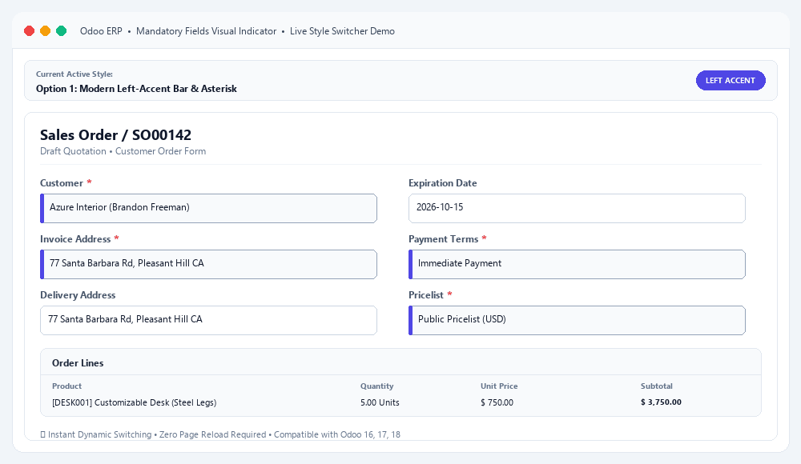

# Mandatory Fields Visual Indicator (`mandatory_fields_indicator`)

  

 

---

**Mandatory Fields Visual Indicator** adalah modul Odoo yang memberikan indikator visual modern, elegan, dan dapat dikonfigurasi secara fleksibel untuk semua field wajib (*required/mandatory fields*) di seluruh formulir backend Odoo. Membantu pengguna mengenali input yang wajib diisi secara instan dan mencegah error validasi sebelum form disimpan.

---

## 🌟 Fitur Utama (Key Features)

- 🎨 **8 Pilihan Gaya Visual Modern**:
  - `left_accent`: **Modern Left-Accent Bar & Asterisk** (Garis aksen indigo di sisi kiri input).
  - `soft_tint`: **Soft Dynamic Pastel Tint & Asterisk** (Latar pastel amber lembut dinamis).
  - `badge`: **Explicit [Required] Badge Pill** (Badge penanda melayang `[Required]`).
  - `gradient_glow`: **Cyber Indigo Gradient & Soft Glow** (Gradasi cyber modern dengan pendar halus).
  - `pulse_dot`: **Coral Pulse Dot & Floating Tag** (Micro-animasi titik berdenyut gaya Linear / Notion).
  - `executive_gold`: **Executive Amber Gold Accent** (Aksen emas mewah untuk tampilan enterprise).
  - `glassmorphism`: **Frosted Card Outline & Sapphire Glow** (Desain kaca frosted gaya Apple macOS).
  - `asterisk_only`: **Classic Red Asterisk Only** (Tanda bintang merah klasik minimalis).
- ⚡ **Zero-Reload Live Theme Switch**: Penggantian gaya visual di konfigurasi langsung diterapkan secara instan ke seluruh form tanpa perlu restart server atau reload browser manual.
- 🧠 **Intelligent Readonly Suppression**: Indikator secara otomatis dinonaktifkan ketika form berada dalam status *Readonly* atau saat field berubah menjadi view-only, sehingga tampilan tetap bersih.
- 🚀 **Zero Database Overhead**: Tidak mengubah struktur tabel database; konfigurasi disimpan rapi di `ir.config_parameter` dan disuntikkan via session info.
- 🌐 **Multi-Language (i18n)**: Mendukung Bahasa Indonesia dan English secara native menggunakan standar GNU gettext (`.po` / `.pot`).
- 🧩 **Kompatibilitas Luas**: Kompatibel penuh dengan form standar Odoo (Sales, Purchase, CRM, Accounting, Inventory, HR) maupun modul kustom pihak ketiga.

---

## 📋 Prasyarat & Ketergantungan (Requirements)

### Modul Odoo:
- `web`
- `base_setup`

### Versi Odoo yang Didukung:
- Odoo 16.0 (Community & Enterprise)
- Odoo 17.0 (Community & Enterprise)
- Odoo 18.0 (Community & Enterprise)

---

## ⚙️ Konfigurasi (Configuration)

1. Buka menu **Settings** > **General Settings**.
2. Gulir ke bagian **Mandatory Fields Visual Indicator**.
3. Pilih salah satu dari **8 Gaya Visual** pada dropdown *Mandatory Field Visual Style*.
4. Klik **Save**. Gaya visual baru akan langsung aktif di seluruh formulir.

---

## 🚀 Panduan Penggunaan (Usage Guide)

1. Buka formulir pembuatan atau pengeditan data apa pun di Odoo (misal: *Sales Order*, *Customer*, *Vendor Bill*, *Product*).
2. Semua field yang bertanda `required="1"` atau `mandatory` akan otomatis memiliki penanda visual sesuai opsi yang dipilih di Settings.
3. Saat pengguna mengisi data atau saat field beralih menjadi readonly, styling akan menyesuaikan secara dinamis dan seamless.

---

## 🎨 Tabel Pilihan Gaya Visual

| No | Nama Gaya | Tampilan Visual | Karakteristik Desain |
|:---|:---|:---|:---|
| **1** | **Modern Left-Accent Bar** | Garis tebal Indigo di sisi kiri input + Asterisk | *Clean, profesional, standar UI modern* |
| **2** | **Soft Pastel Tint** | Background pastel amber lembut + Asterisk | *Mudah dibaca, kontras lembut dan nyaman di mata* |
| **3** | **Explicit [Required] Badge** | Badge pill merah `REQUIRED` di samping label | *Sangat jelas dan eksplisit untuk form yang padat* |
| **4** | **Cyber Indigo Glow** | Gradasi indigo & pendaran bayangan halus | *Futuristik, modern, dan berkelas* |
| **5** | **Coral Pulse Dot** | Titik denyut animasi coral + tag mengambang | *Interaktif, micro-interaction Notion/Linear style* |
| **6** | **Executive Amber Gold** | Aksen border emas & background hangat | *Mewah, cocok untuk eksekutif & enterprise suite* |
| **7** | **Sapphire Glassmorphism** | Bingkai frosted glass & pendaran safir | *Transparan, estetika Apple macOS & Fluent UI* |
| **8** | **Classic Asterisk Only** | Tanda bintang merah `*` saja | *Minimalis, klasik, tanpa perubahan warna input* |

---

## 👥 Kontributor & Hak Cipta (Contributors)

* **CV. Anugerah Khair Arkananta** (<info@arkananta.id>)
* Website: [https://github.com/lalaingampus/mandatory_fields_indicator](https://github.com/lalaingampus/mandatory_fields_indicator)

---

## 📄 Lisensi (License)

Modul ini dilisensikan di bawah **LGPL-3.0** atau yang lebih baru.  
Lihat file [LICENSE](LICENSE) atau [GNU Lesser General Public License](https://www.gnu.org/licenses/lgpl-3.0.html) untuk informasi lebih lanjut.
